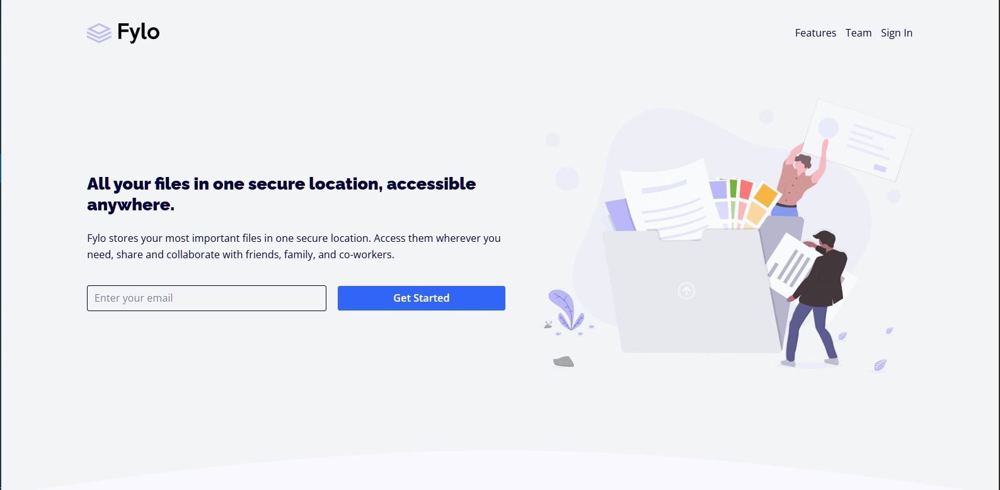

# Frontend Mentor - Fylo landing page with two column layout solution

This is a solution to the [Fylo landing page with two column layout challenge on Frontend Mentor](https://www.frontendmentor.io/challenges/fylo-landing-page-with-two-column-layout-5ca5ef041e82137ec91a50f5). Frontend Mentor challenges help you improve your coding skills by building realistic projects. 

## Table of contents

- [Overview](#overview)
  - [The challenge](#the-challenge)
  - [Screenshot](#screenshot)
  - [Links](#links)
- [My process](#my-process)
  - [Built with](#built-with)
  - [What I learned](#what-i-learned)
  - [Continued development](#continued-development)
  - [Useful resources](#useful-resources)
- [Author](#author)
- [Acknowledgments](#acknowledgments)

**Note: Delete this note and update the table of contents based on what sections you keep.**

## Overview

### The challenge

Users should be able to:

- View the optimal layout for the site depending on their device's screen size
- See hover states for all interactive elements on the page

### Screenshot

### Links

- Solution URL: [Add solution URL here](https://github.com/cocode305/Frontend-Mentor-Fylo-landing-page-with-two-column-layout.git)
- Live Site URL: [Add live site URL here](https://cocode305.github.io/Frontend-Mentor-Fylo-landing-page-with-two-column-layout/)

## My process

### Built with

- Semantic HTML5 markup
- CSS custom properties
- Flexbox
- Mobile-first workflow

### What I learned
It's been a great experience using Tailwind to build projects, it blows Vanila CSS out the window!
One key element I love about using Tailwind to build is how I can easily create responsive components without writing long media queries for them, I can basically use the specific breakpoint utility class and bam!

## Author

- Website - [Collins](https://www.your-site.com)
- Frontend Mentor - [@cocode305](https://www.frontendmentor.io/profile/cocode305)
- Twitter - [@xo_co_co](https://www.twitter.com/xo_co_co)

